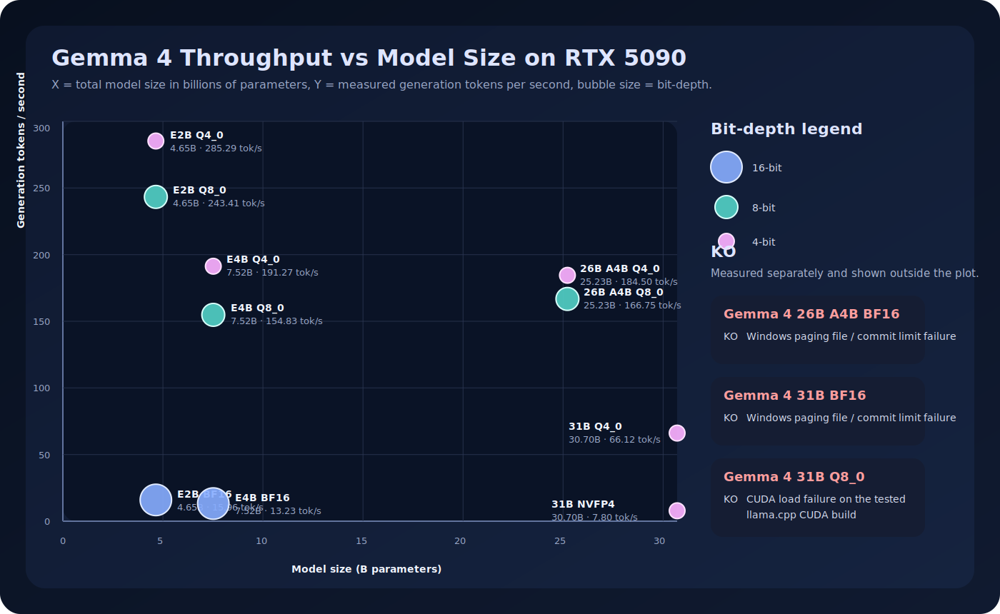
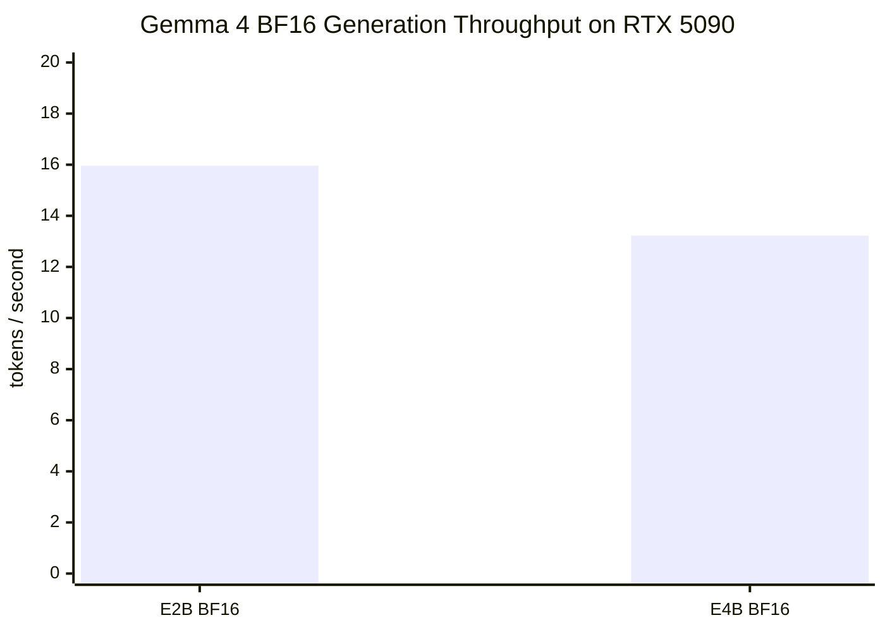
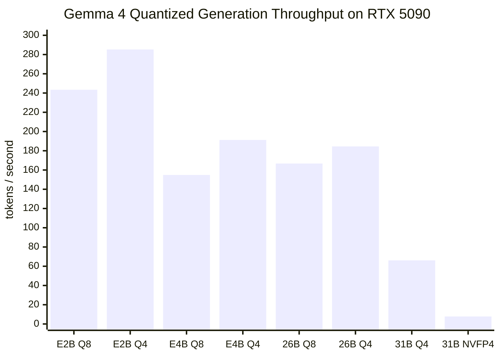
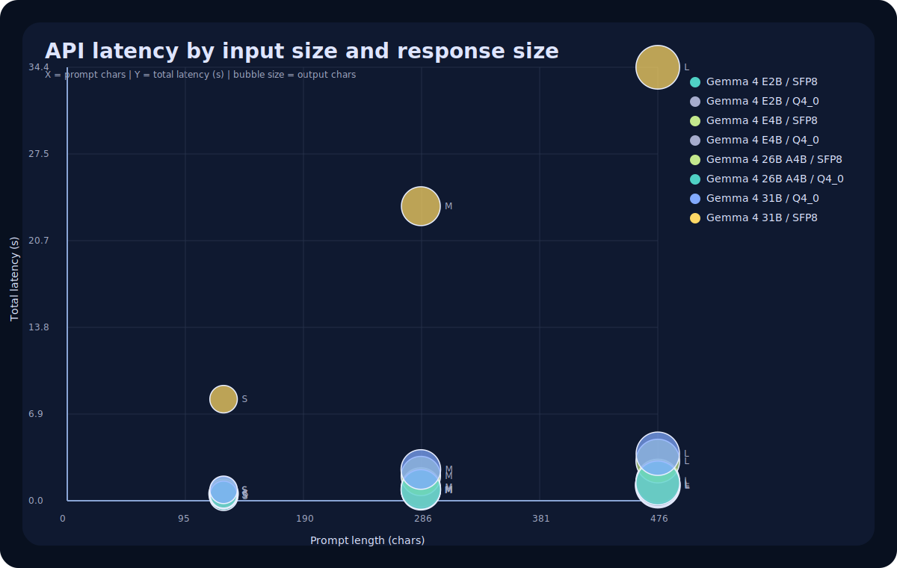

# Gemma 4 Local Lab

Local Gemma 4 workstation lab with:

- FastAPI backend
- React frontend
- local TTS
- model / quantization switching
- experimental WSL `vLLM` bridge for `nvidia/Gemma-4-31B-IT-NVFP4`
- benchmark scripts and benchmark reports

Useful docs:

- [API.md](./API.md)
- [SETUP.md](./SETUP.md)

## Install and launch

### First-time full install

Use the bootstrap script below if you want the repo to install its Python deps, web deps, `llama.cpp`, the WSL `vLLM` env for `NVFP4`, the Piper voice, then prefetch every Gemma checkpoint used by the lab:

```powershell
.\install_and_run_gemma4_lab.ps1
```

What it does:

- creates or reuses `.venv`
- installs Python packages from `requirements-lab.txt`
- runs `npm ci` and `npm run build` in [web/package.json](C:/Users/Anis AYARI/Desktop/projects/gemma4-test/web/package.json)
- installs the pinned Windows CUDA `llama.cpp` binaries if `tools/llama.cpp/bin` is missing
- prepares `~/vllm-gemma4` inside `WSL Ubuntu` for `nvidia/Gemma-4-31B-IT-NVFP4`
- predownloads BF16 Gemma 4, GGUF quantized checkpoints, the NVIDIA `NVFP4` checkpoint, and the default Piper voice
- launches the lab on [http://127.0.0.1:8000](http://127.0.0.1:8000)

Important notes:

- the default bootstrap is intentionally heavy and can download a lot of data because it prefetches every model family used by the lab
- `NVFP4` setup expects a `WSL` distro named `Ubuntu`
- the Windows and WSL runtimes now share the same Hugging Face cache in `.\.hf-cache`, so the NVIDIA path does not redownload weights once they are prefetched

### Quick relaunch

Once the environment is already installed, the fast path is:

```powershell
.\run_gemma4_lab.ps1
```

That script rebuilds the frontend, stops any previous process already bound to port `8000`, and starts the FastAPI app.

### Install only

If you want to prepare everything without immediately starting the server:

```powershell
.\install_and_run_gemma4_lab.ps1 -InstallOnly
```

### Useful bootstrap flags

```powershell
.\install_and_run_gemma4_lab.ps1 -InstallOnly -SkipWSLNVFP4
.\install_and_run_gemma4_lab.ps1 -InstallOnly -SkipModelDownloads
.\install_and_run_gemma4_lab.ps1 -InstallOnly -SkipGGUF -SkipNVFP4
```

These are the main switches:

- `-SkipWSLNVFP4`: skip the `WSL vLLM` environment for the NVIDIA model
- `-SkipModelDownloads`: install dependencies only, without prefetching checkpoints
- `-SkipBF16`: skip the official Google BF16 checkpoints
- `-SkipGGUF`: skip the `llama.cpp` quantized checkpoints
- `-SkipNVFP4`: skip the NVIDIA `nvidia/Gemma-4-31B-IT-NVFP4` checkpoint
- `-SkipTTS`: skip the local Piper voice assets

### Prefetch only

If you already have the env and just want to fill the shared cache manually:

```powershell
.\.venv\Scripts\python.exe .\scripts\prefetch_gemma4_assets.py
```

Examples:

```powershell
.\.venv\Scripts\python.exe .\scripts\prefetch_gemma4_assets.py --skip-nvfp4
.\.venv\Scripts\python.exe .\scripts\prefetch_gemma4_assets.py --skip-gguf --skip-tts
```

## Benchmark setup

- GPU: `NVIDIA GeForce RTX 5090 32 GB`
- Driver: `581.42`
- CPU: `AMD Ryzen 9 9950X3D`
- Date: `2026-04-04`

Three benchmark paths were measured:

1. `BF16` with the local `Transformers` runtime used by the app backend
2. quantized `GGUF` models with `llama.cpp` CUDA
3. `NVFP4 / ModelOpt FP4` with `vLLM` on `WSL Ubuntu`

Important note:

- the Google table you sent lists `BF16 / SFP8 / Q4_0`
- in the live lab UI, the `SFP8` slot is now routed to a practical local `Q8_0 GGUF` runtime through `llama.cpp`
- the practical 8-bit benchmark I measured locally is therefore `Q8_0`, not the exact Google `SFP8` tensor format
- the practical 4-bit benchmark I measured locally is `Q4_0`

## Current runtime mapping in the lab

This is what the current app actually does when you click `Load model`:

| UI quantization | Actual local runtime | Checkpoint family |
| --- | --- | --- |
| `BF16` | `Transformers` | official Hugging Face Google checkpoints |
| `SFP8` | `llama.cpp` | `Q8_0 GGUF` fallback used as the local 8-bit path |
| `Q4_0` | `llama.cpp` | `Q4_0 GGUF` |
| `NVFP4` | `vLLM` on `WSL Ubuntu` | `nvidia/Gemma-4-31B-IT-NVFP4` |

Load status validated in the current lab build:

- `Gemma 4 E2B / SFP8` loads and answers through `llama.cpp`
- `Gemma 4 E4B / SFP8` loads through `llama.cpp`
- `Gemma 4 26B A4B / SFP8` loads through `llama.cpp`
- `Gemma 4 31B / SFP8` loads and answers through `llama.cpp`
- `Gemma 4 31B IT NVFP4 / NVFP4` loads and answers through `WSL vLLM`

Note:

- the benchmark tables below are historical measurements from the earlier benchmark runs saved in `benchmark/results`
- the live load matrix above reflects the current app runtime after the cache-routing and `SFP8 -> Q8_0` fixes

## Generation throughput graphs

### Bubble chart



This chart uses:

- `X` = total model size in billions of parameters
- `Y` = measured generation tokens per second
- bubble size = bit-depth, with `16-bit` larger than `8-bit`, and `8-bit` larger than `4-bit`
- `KO` models shown on the right when they did not run cleanly on this workstation

### BF16 gen tok/s



### Quantized gen tok/s



## API load test

The API load test exercises the real local HTTP server rather than raw model runners. It measures:

- model load time
- streaming time to first token
- total response latency
- prompt length vs output length
- effective parallelism under the current request queue

Latest artifacts:

- [API load test report](./benchmark/results/gemma4-api-loadtest-latest.md)
- [API load test JSON](./benchmark/results/gemma4-api-loadtest-latest.json)

### API latency graph



### API parallel graph


## BF16 benchmark

Runtime:

- `Transformers`
- text-only generation
- one model per fresh Python process
- warmup before measured runs

| Model | Status | Mean gen tok/s | Best gen tok/s | Load time | VRAM after load |
| --- | --- | ---: | ---: | ---: | ---: |
| Gemma 4 E2B | ok | 15.96 | 16.20 | 10.69 s | 9.67 GiB |
| Gemma 4 E4B | ok | 13.23 | 13.26 | 11.10 s | 14.90 GiB |
| Gemma 4 26B A4B | failed | - | - | - | - |
| Gemma 4 31B | failed | - | - | - | - |

BF16 failure notes:

- `Gemma 4 26B A4B`: Windows paging file / commit limit failure during load
- `Gemma 4 31B`: Windows paging file / commit limit failure during load

## Quantized GGUF benchmark

Runtime:

- `llama.cpp` CUDA
- prompt benchmark: `256` prompt tokens
- generation benchmark: `128` generated tokens
- repetitions: `2`

| Model | Quant | Source | Prompt tok/s | Gen tok/s | Status |
| --- | --- | --- | ---: | ---: | --- |
| Gemma 4 E2B | Q8_0 | official | 16545.45 | 243.41 | ok |
| Gemma 4 E2B | Q4_0 | community | 13077.21 | 285.29 | ok |
| Gemma 4 E4B | Q8_0 | official | 10537.28 | 154.83 | ok |
| Gemma 4 E4B | Q4_0 | community | 9387.39 | 191.27 | ok |
| Gemma 4 26B A4B | Q8_0 | official | 5795.03 | 166.75 | ok |
| Gemma 4 26B A4B | Q4_0 | community | 5267.01 | 184.50 | ok |
| Gemma 4 31B | Q8_0 | official | - | - | failed |
| Gemma 4 31B | Q4_0 | community | 3530.86 | 66.12 | ok |

Quantized failure notes:

- `Gemma 4 31B Q8_0`: CUDA load failure on this RTX 5090 setup with the tested `llama.cpp` build

## NVIDIA NVFP4 benchmark

Runtime:

- `vLLM 0.19.0` on `WSL Ubuntu`
- `nvidia/Gemma-4-31B-IT-NVFP4`
- `VLLM_NVFP4_GEMM_BACKEND=cutlass`
- guarded from Windows with timeout, GPU polling, and WSL cleanup
- benchmark config: `max_model_len=256`, `gpu_memory_utilization=0.94`, `max_tokens=64`, `enforce_eager=True`, `cpu_offload_gb=0.0`

| Model | Quant | Runtime | Status | Gen tok/s | Load time | Notes |
| --- | --- | --- | --- | ---: | ---: | --- |
| Gemma 4 31B IT NVFP4 | NVFP4 | WSL vLLM | ok | 7.80 | 322.00 s | validated on RTX 5090 single-GPU setup |

NVFP4 notes:

- the official NVIDIA model card targets `vLLM`, `NVIDIA Blackwell`, and preferred OS `Linux`
- on this machine, the model now runs through a local `WSL` bridge in the lab
- the lab runtime defaults to `max_model_len=256` so text and image turns fit cleanly on this RTX 5090 setup
- the throughput benchmark stays at `256` context because that was the most stable high-pressure config for measuring decode speed

## Quick takeaways

- Fastest small model: `Gemma 4 E2B Q4_0` at `285.29 tok/s`
- Best balanced small model: `Gemma 4 E4B Q4_0` at `191.27 tok/s`
- Biggest model that ran cleanly in quantized mode: `Gemma 4 31B Q4_0` at `66.12 tok/s`
- Best large-model compromise on this machine: `Gemma 4 26B A4B Q4_0` at `184.50 tok/s`
- NVIDIA path validated: `Gemma 4 31B IT NVFP4` now runs in the lab through `WSL vLLM` at `7.80 tok/s`
- On this single RTX 5090 setup, `31B Q4_0` remains much faster than `31B NVFP4`; the NVIDIA checkpoint is more about compatibility with the official ModelOpt/vLLM stack than raw local throughput here

## Files

- BF16 summary: `benchmark/results/gemma4-5090-summary-20260404.md`
- GGUF summary: `benchmark/results/gemma4-gguf-benchmark-20260404-202529.md`
- NVFP4 summary: `benchmark/results/gemma4-nvfp4-vllm-summary-latest.md`
- NVFP4 dated summary: `benchmark/results/gemma4-nvfp4-vllm-summary-20260405.md`
- BF16 raw JSON:
  - `benchmark/results/gemma4-5090-benchmark-20260404-194128.json`
  - `benchmark/results/gemma4-5090-benchmark-20260404-194004.json`
  - `benchmark/results/gemma4-5090-benchmark-20260404-194021.json`
  - `benchmark/results/gemma4-5090-benchmark-20260404-194036.json`
- GGUF raw JSON:
  - `benchmark/results/gemma4-gguf-benchmark-20260404-202529.json`
- NVFP4 raw JSON:
  - `benchmark/results/gemma4-nvfp4-vllm-benchmark-latest.json`

## Re-run

BF16:

```powershell
.\.venv\Scripts\python.exe .\benchmark\benchmark_gemma4.py --models e2b e4b 26b-a4b 31b --max-new-tokens 128 --warmup-tokens 32 --runs 2
```

GGUF:

```powershell
.\.venv\Scripts\python.exe .\benchmark\benchmark_gemma4_gguf.py
```

NVFP4:

```powershell
.\.venv\Scripts\python.exe .\benchmark\benchmark_nvfp4_vllm_guarded.py --max-model-len 256 --gpu-memory-utilization 0.94 --max-tokens 64
```
