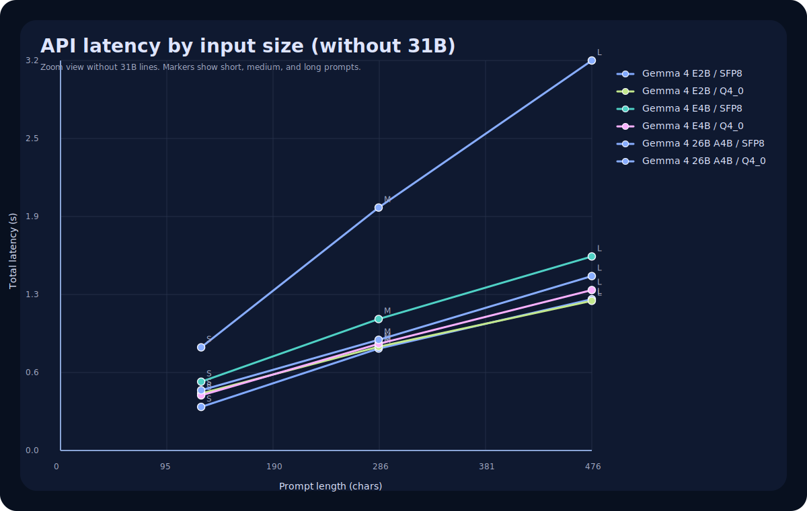
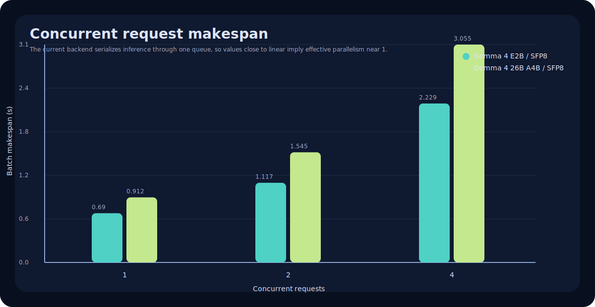

# API Load Test

Generated on 2026-04-05 16:15:37.

## Why audio is rejected on the current quantized runtime

- Probe result on `e2b:sfp8`: HTTP `400` with `Gemma 4 E2B in SFP8 does not support audio input in this runtime path.`.
- In this app, the quantized `llama.cpp` path explicitly rejects audio input before inference. Image is wired through; audio is not on that runtime path.

## Load results

| Model | Load OK | Load time (s) | Runtime | Runtime modalities | Notes |
| --- | --- | ---: | --- | --- | --- |
| Gemma 4 E2B / SFP8 | yes | 0.029 | llama.cpp | text, image | Gemma 4 E2B is already loaded in SFP8. |
| Gemma 4 E2B / Q4_0 | yes | 29.088 | llama.cpp | text, image | Gemma 4 E2B is ready in Q4_0. |
| Gemma 4 E4B / SFP8 | yes | 32.194 | llama.cpp | text, image | Gemma 4 E4B is ready in SFP8. |
| Gemma 4 E4B / Q4_0 | yes | 31.03 | llama.cpp | text, image | Gemma 4 E4B is ready in Q4_0. |
| Gemma 4 26B A4B / SFP8 | yes | 35.293 | llama.cpp | text, image | Gemma 4 26B A4B is ready in SFP8. |
| Gemma 4 26B A4B / Q4_0 | yes | 71.696 | llama.cpp | text, image | Gemma 4 26B A4B is ready in Q4_0. |
| Gemma 4 31B / Q4_0 | yes | 54.688 | llama.cpp | text, image | Gemma 4 31B is ready in Q4_0. |
| Gemma 4 31B / SFP8 | yes | 45.912 | llama.cpp | text, image | Gemma 4 31B is ready in SFP8. |
| Gemma 4 31B IT NVFP4 / NVFP4 | no | 96.055 | - | - | Gemma 4 31B IT NVFP4 could not be loaded because the machine ran out of memory. Free RAM or VRAM, or switch to a smaller Gemma 4 variant. |

## Workload matrix

| Model | Workload | Input chars | Max tokens | TTFT (s) | Total (s) | Output chars | Completion tokens | Finish |
| --- | --- | ---: | ---: | ---: | ---: | ---: | ---: | --- |
| Gemma 4 E2B / SFP8 | short | 126 | 64 | 0.102 | 0.352 | 206 | - | stop |
| Gemma 4 E2B / SFP8 | medium | 285 | 128 | 0.118 | 0.824 | 566 | - | length |
| Gemma 4 E2B / SFP8 | long | 476 | 192 | 0.144 | 1.223 | 762 | - | length |
| Gemma 4 E2B / Q4_0 | short | 126 | 64 | 0.255 | 0.461 | 182 | - | stop |
| Gemma 4 E2B / Q4_0 | medium | 285 | 128 | 0.139 | 0.839 | 527 | - | length |
| Gemma 4 E2B / Q4_0 | long | 476 | 192 | 0.113 | 1.21 | 822 | - | length |
| Gemma 4 E4B / SFP8 | short | 126 | 64 | 0.16 | 0.556 | 232 | - | stop |
| Gemma 4 E4B / SFP8 | medium | 285 | 128 | 0.124 | 1.063 | 562 | - | length |
| Gemma 4 E4B / SFP8 | long | 476 | 192 | 0.122 | 1.569 | 765 | - | length |
| Gemma 4 E4B / Q4_0 | short | 126 | 64 | 0.188 | 0.446 | 182 | - | stop |
| Gemma 4 E4B / Q4_0 | medium | 285 | 128 | 0.116 | 0.862 | 555 | - | length |
| Gemma 4 E4B / Q4_0 | long | 476 | 192 | 0.143 | 1.297 | 792 | - | length |
| Gemma 4 26B A4B / SFP8 | short | 126 | 64 | 0.256 | 0.834 | 167 | - | stop |
| Gemma 4 26B A4B / SFP8 | medium | 285 | 128 | 0.181 | 1.964 | 571 | - | length |
| Gemma 4 26B A4B / SFP8 | long | 476 | 192 | 0.222 | 3.153 | 760 | - | length |
| Gemma 4 26B A4B / Q4_0 | short | 126 | 64 | 0.245 | 0.487 | 171 | - | stop |
| Gemma 4 26B A4B / Q4_0 | medium | 285 | 128 | 0.162 | 0.895 | 581 | - | length |
| Gemma 4 26B A4B / Q4_0 | long | 476 | 192 | 0.164 | 1.41 | 767 | - | length |
| Gemma 4 31B / Q4_0 | short | 126 | 64 | 0.159 | 0.864 | 185 | - | stop |
| Gemma 4 31B / Q4_0 | medium | 285 | 128 | 0.21 | 2.48 | 581 | - | length |
| Gemma 4 31B / Q4_0 | long | 476 | 192 | 0.264 | 3.733 | 746 | - | length |
| Gemma 4 31B / SFP8 | short | 126 | 64 | 1.948 | 8.063 | 184 | - | stop |
| Gemma 4 31B / SFP8 | medium | 285 | 128 | 2.64 | 23.387 | 552 | - | length |
| Gemma 4 31B / SFP8 | long | 476 | 192 | 3.296 | 34.419 | 760 | - | length |

## Latency graph

## Latency graph without 31B

## Parallel request test

| Model | Concurrent requests | Makespan (s) | Avg latency (s) | Max latency (s) | Effective parallelism |
| --- | ---: | ---: | ---: | ---: | ---: |
| Gemma 4 E2B / SFP8 | 1 | 0.69 | 0.688 | 0.688 | 1.0 |
| Gemma 4 E2B / SFP8 | 2 | 1.117 | 0.85 | 1.117 | 1.24 |
| Gemma 4 E2B / SFP8 | 4 | 2.229 | 1.41 | 2.227 | 1.24 |
| Gemma 4 26B A4B / SFP8 | 1 | 0.912 | 0.912 | 0.912 | 1.0 |
| Gemma 4 26B A4B / SFP8 | 2 | 1.545 | 1.166 | 1.544 | 1.18 |
| Gemma 4 26B A4B / SFP8 | 4 | 3.055 | 1.94 | 3.055 | 1.19 |

- The current backend uses one inference queue, so practical parallel inference stays close to 1 active request at a time.
- Health, monitoring, and request-status routes remain callable while the queue is busy.

## KO

- `Gemma 4 31B IT NVFP4 / NVFP4`: Gemma 4 31B IT NVFP4 could not be loaded because the machine ran out of memory. Free RAM or VRAM, or switch to a smaller Gemma 4 variant.
